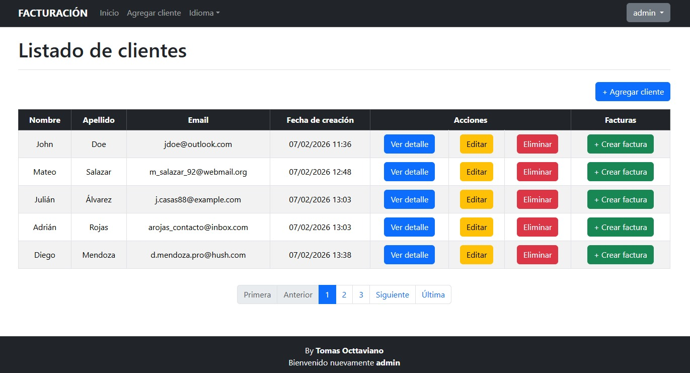
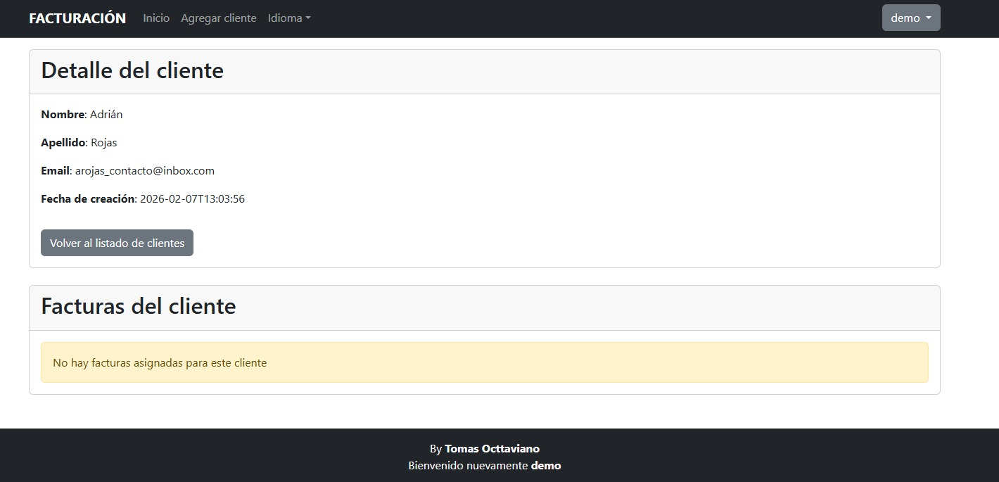
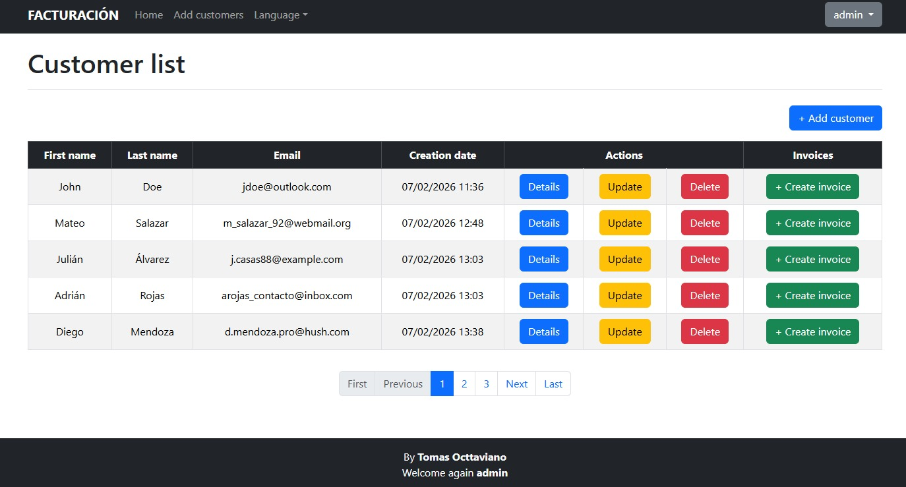
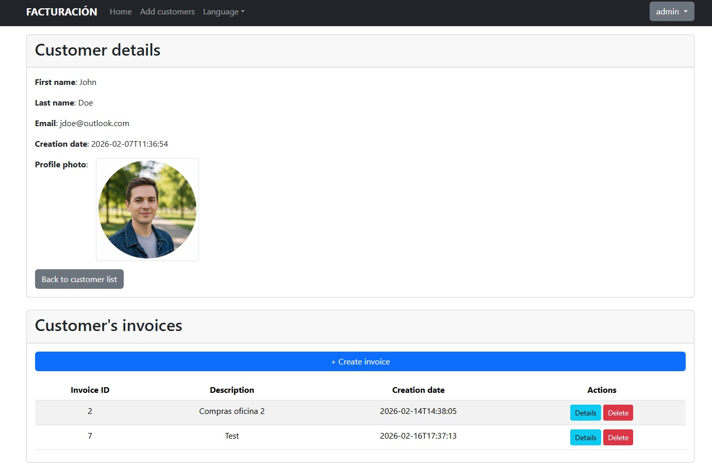
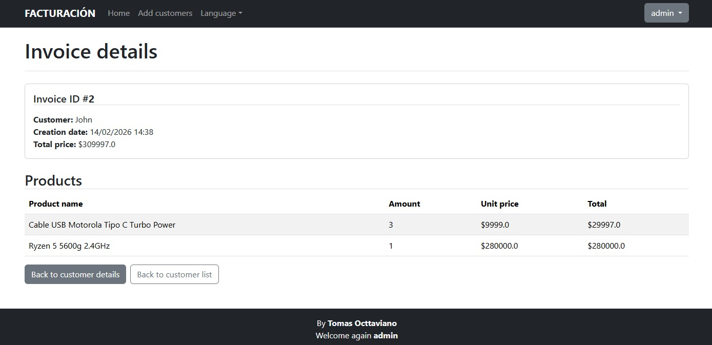

# Sistema de facturación

## Breve descripción

Pequeño sistema de gestión de cliente y alta de facturas para los mismos. El objetivo del proyecto fue profundizar un poco más en el desarrollo de aplicaciones monolíticas con Spring Boot basadas en el patrón MVC, integrando seguridad, vistas con Thymeleaf, multilenguaje y manejo de datos con JPA

## Tecnologías

Tecnologías que utilicé:
* **Backend**
  - Java
  - Spring Boot v3.5.10
  - Spring Data JPA
  - Spring Security
  - MySQL
* **Frontend**
  - HTML
  - Bootstrap
  - JQuery
  - Thymeleaf
* **Otros**
  - Multilenguaje i18n

## Imágenes

